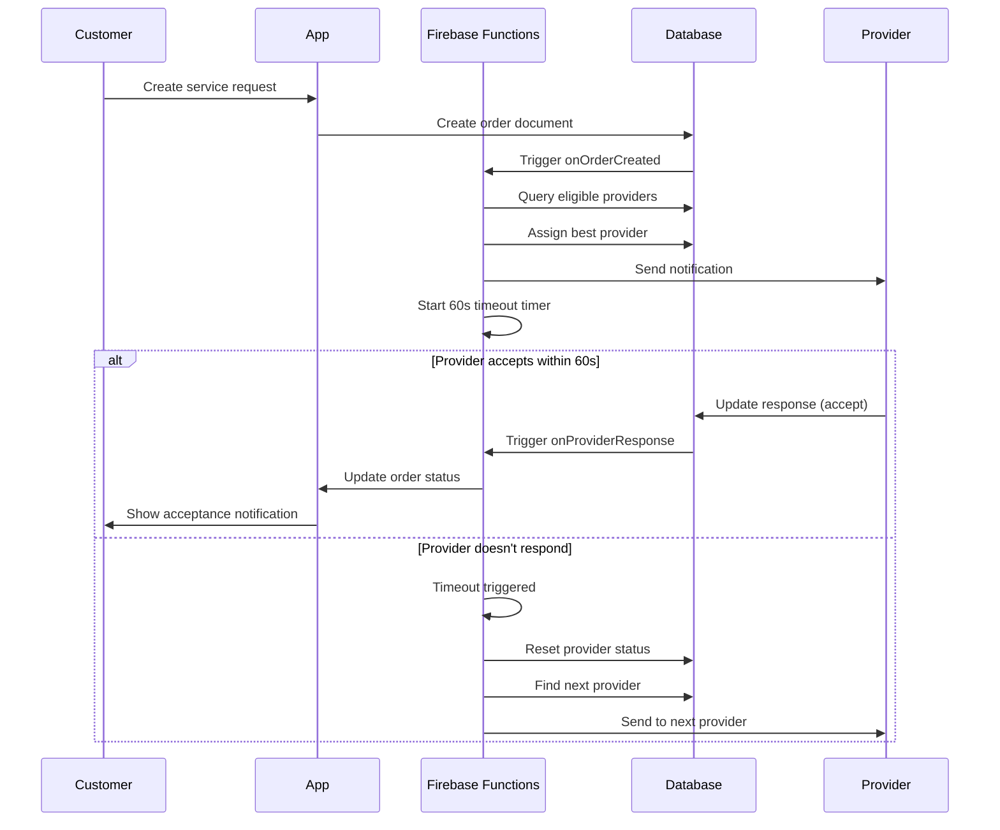

# 🚀 Order Dispatch & Matching Engine - Complete Implementation Guide

## 📋 Table of Contents
1. [Core Algorithm Pseudocode](#core-algorithm-pseudocode)
2. [Database Schema](#database-schema)
3. [Implementation Architecture](#implementation-architecture)
4. [State Transition Flow](#state-transition-flow)
5. [Service-Specific Matching Rules](#service-specific-matching-rules)
6. [Testing & Deployment Guide](#testing--deployment-guide)
7. [Performance Optimization](#performance-optimization)

---

## 🧠 Core Algorithm Pseudocode

### Main Dispatch Algorithm
```pseudocode
ALGORITHM: dispatchRequest(orderId, service, serviceClass, customerLocation)

BEGIN
    // Initialize tracking
    attemptNumber = getDispatchAttempts(orderId) + 1
    
    IF attemptNumber > MAX_ATTEMPTS THEN
        updateOrderStatus(orderId, "failed")
        RETURN false
    END IF
    
    // Find eligible providers
    eligibleProviders = findEligibleProviders(service, serviceClass, customerLocation, orderId)
    
    IF eligibleProviders.isEmpty() THEN
        IF attemptNumber >= MAX_ATTEMPTS THEN
            updateOrderStatus(orderId, "failed")
            RETURN false
        ELSE
            scheduleRetryWithExpandedRadius(orderId, 10_seconds)
            RETURN false
        END IF
    END IF
    
    // Select best provider
    selectedProvider = eligibleProviders[0] // Highest scored
    
    // Assign and start timeout
    assignProviderToOrder(orderId, selectedProvider)
    trackAttemptedProvider(orderId, selectedProvider.id)
    startTimeoutTimer(orderId, 60_seconds)
    
    RETURN true
END

ALGORITHM: findEligibleProviders(service, serviceClass, customerLocation, orderId)

BEGIN
    // Step 1: Geographic filtering
    nearbyProviders = queryProvidersWithinRadius(
        service: service,
        location: customerLocation,
        radius: DEFAULT_RADIUS_KM,
        status: "active",
        availabilityOnline: true,
        availabilityStatus: ["available", "idle"]
    )
    
    eligibleProviders = []
    attemptedList = getAttemptedProviders(orderId)
    
    FOR EACH provider IN nearbyProviders DO
        // Skip already attempted providers
        IF attemptedList.contains(provider.userId) THEN
            CONTINUE
        END IF
        
        // Step 2: Service class validation
        IF NOT supportsServiceClass(provider, serviceClass) THEN
            CONTINUE
        END IF
        
        // Step 3: Service-specific validation
        IF NOT passesServiceValidation(service, serviceClass, provider) THEN
            CONTINUE
        END IF
        
        // Step 4: Calculate score
        distance = calculateDistance(customerLocation, provider.location)
        score = calculateProviderScore(distance, provider.rating, provider.completedOrders, provider.responseTime)
        
        eligibleProviders.add({
            id: provider.userId,
            distance: distance,
            score: score,
            metadata: provider
        })
    END FOR
    
    // Step 5: Sort by score (descending)
    eligibleProviders.sortByScore(descending: true)
    
    RETURN eligibleProviders.take(MAX_PROVIDERS_PER_ATTEMPT)
END

ALGORITHM: timeoutHandler(orderId)

BEGIN
    // Check if order was accepted
    currentOrder = getOrderData(orderId)
    IF currentOrder.status == "accepted" THEN
        cleanup(orderId)
        RETURN
    END IF
    
    // Handle timeout
    IF currentOrder.providerId != null THEN
        handleProviderTimeout(currentOrder.providerId)
        recordDispatchAttempt(orderId, currentOrder.providerId, "timed_out")
    END IF
    
    // Re-dispatch
    updateOrderStatus(orderId, "searching")
    success = dispatchRequest(orderId, currentOrder.service, currentOrder.serviceClass, currentOrder.customerLocation)
    
    IF NOT success THEN
        updateOrderStatus(orderId, "failed")
    END IF
END

ALGORITHM: calculateProviderScore(distance, rating, completedOrders, responseTime)

BEGIN
    distanceScore = max(0, 100 - (distance * 15))           // Closer = better
    ratingScore = (rating / 5.0) * 100                      // 5 stars = 100 points
    experienceScore = min(50, completedOrders * 0.5)        // Experience bonus
    speedScore = max(0, 50 - responseTime)                  // Faster = better
    
    totalScore = (distanceScore * 0.35) +                   // Distance weight: 35%
                 (ratingScore * 0.25) +                     // Rating weight: 25%
                 (experienceScore * 0.20) +                 // Experience weight: 20%
                 (speedScore * 0.20)                        // Speed weight: 20%
    
    RETURN totalScore
END
```

---

## 🗄️ Database Schema

### Optimized Collections Structure

#### `provider_profiles` Collection
```json
{
  "userId": "provider_123",
  "service": "transport",
  "subcategory": "Taxi",
  "status": "active",
  
  // Real-time availability
  "availabilityOnline": true,
  "availabilityStatus": "available", // available | assigned | busy | offline
  "currentOrderId": null,
  
  // Location (GeoPoint for proximity queries)
  "currentLocation": {
    "latitude": 6.5244,
    "longitude": 3.3792,
    "lastUpdated": "2024-01-15T10:30:00Z",
    "accuracy": 10.5
  },
  
  // Service class configuration (CRITICAL for matching)
  "enabledClasses": {
    "standard": true,
    "compact": true,
    "suv": false,
    "luxury": true
  },
  
  // Performance metrics (for scoring)
  "rating": 4.7,
  "completedOrders": 156,
  "avgResponseTime": 25.0,
  "completionRate": 0.95,
  "acceptanceRate": 0.88,
  
  // Service-specific metadata
  "metadata": {
    "vehicleCapacity": 4,
    "vehicleType": "sedan",
    "serviceRadius": 5.0
  },
  
  // Emergency/Hire specific
  "certifications": ["medical_transport", "first_aid"],
  "equipment": ["medical_equipment"],
  "skills": ["plumbing", "electrical"]
}
```

#### Orders Collection (Service-Specific)
```json
{
  "customerId": "customer_456",
  "providerId": null, // Set during dispatch
  "service": "transport",
  "serviceClass": "standard",
  
  // State management
  "status": "pending", // Service-specific status
  "internalState": "pending", // Internal state for engine
  "statusMessage": "Finding providers...",
  
  // Location data
  "customerLocation": {
    "latitude": 6.5244,
    "longitude": 3.3792,
    "address": "123 Main St"
  },
  
  // Dispatch tracking
  "dispatchAttempt": 0,
  "dispatchHistory": [
    {
      "attemptNumber": 1,
      "providerId": "provider_789",
      "dispatchedAt": "2024-01-15T10:30:00Z",
      "status": "timed_out",
      "responseTime": 60
    }
  ],
  
  // State history
  "stateHistory": [
    {
      "state": "pending",
      "timestamp": "2024-01-15T10:29:00Z",
      "reason": "Order created"
    }
  ],
  
  // Timestamps
  "createdAt": "2024-01-15T10:29:00Z",
  "updatedAt": "2024-01-15T10:30:00Z"
}
```

---

## 🏗️ Implementation Architecture

### Core Components

1. **OrderDispatchEngine** (Dart/Flutter)
   - Client-side order creation and monitoring
   - Real-time state updates
   - UI integration

2. **MatchingEngine** (Node.js/Firebase Functions)
   - Server-side provider matching
   - Timeout handling
   - Geographic queries

3. **OrderStateManager** (Dart/Flutter)
   - State transition validation
   - Event handling
   - Metrics tracking

### Integration Flow



---

## 🔄 State Transition Flow

### Complete Order Lifecycle

```
[PENDING] ──────────────────┐
    │                       │
    ▼                       ▼
[SEARCHING] ────────────> [CANCELLED]
    │                       ▲
    ▼                       │
[DISPATCHED] ──────────────┤
    │                       │
    ├─── timeout ──────────┘
    │                       
    ▼                       
[ACCEPTED] ────────────────┤
    │                       │
    ▼                       ▼
[IN_PROGRESS] ──────────> [CANCELLED]
    │
    ▼
[COMPLETED]

[FAILED] ◄─── (when no providers available)
```

### State Descriptions

| State | Description | Triggers | Next States |
|-------|-------------|----------|-------------|
| `PENDING` | Order created, waiting to start matching | Order creation | `SEARCHING`, `CANCELLED` |
| `SEARCHING` | Looking for available providers | Dispatch trigger | `DISPATCHED`, `FAILED`, `CANCELLED` |
| `DISPATCHED` | Request sent to specific provider | Provider found | `ACCEPTED`, `SEARCHING` (timeout), `CANCELLED` |
| `ACCEPTED` | Provider confirmed request | Provider acceptance | `IN_PROGRESS`, `CANCELLED` |
| `IN_PROGRESS` | Service actively being provided | Service started | `COMPLETED`, `CANCELLED` |
| `COMPLETED` | Service successfully finished | Service completion | *Terminal* |
| `CANCELLED` | Customer or system cancelled | Cancellation request | *Terminal* |
| `FAILED` | No providers available | Max attempts reached | *Terminal* |

---

## 🎯 Service-Specific Matching Rules

### 1. Transport Service
```javascript
// Service classes
const transportClasses = [
  'tricycle',     // 3-wheel vehicle
  'compact',      // Small car (1-3 passengers)
  'standard',     // Standard car (1-4 passengers)
  'suv',          // SUV (1-6 passengers)
  'bike_economy', // Basic motorcycle
  'bike_luxury',  // Premium motorcycle
  'bus_mini',     // 8-14 passengers
  'bus_standard', // 15-25 passengers
  'bus_large',    // 26+ passengers
  'bus_charter'   // Private charter
];

// Matching rules
function validateTransportProvider(requestClass, provider) {
  // 1. Subcategory matching
  const subcategoryMap = {
    'tricycle': 'Tricycle',
    'compact|standard|suv': 'Taxi',
    'bike_economy|bike_luxury': 'Bike',
    'bus_*': 'Bus'
  };
  
  // 2. Capacity validation for buses
  if (requestClass.startsWith('bus_')) {
    const minCapacity = getBusCapacity(requestClass);
    return provider.vehicleCapacity >= minCapacity;
  }
  
  // 3. Explicit class enablement
  return provider.enabledClasses[requestClass] === true;
}
```

### 2. Emergency Service
```javascript
// Emergency classes (STRICT matching required)
const emergencyClasses = [
  'ambulance',           // Medical emergency transport
  'fire_services',       // Fire emergency response
  'security_services',   // Security/safety response
  'towing_van',          // Vehicle towing services
  // Roadside assistance sub-classes (specific matching)
  'roadside_tyre_fix',   // Tyre repair/replacement
  'roadside_battery',    // Battery replacement/jumpstart
  'roadside_fuel',       // Fuel delivery
  'roadside_mechanic',   // On-site mechanical repair
  'roadside_lockout',    // Vehicle lockout assistance
  'roadside_jumpstart'   // Battery jumpstart service
];

// Strict validation - ambulance requests ONLY go to ambulance providers
function validateEmergencyProvider(requestClass, provider) {
  // Must have explicit class enablement
  if (provider.enabledClasses[requestClass] !== true) {
    return false;
  }
  
  // Must have required certifications
  const certRequirements = {
    'ambulance': ['medical_transport', 'first_aid'],
    'fire_services': ['fire_safety', 'emergency_response'],
    'security_services': ['security_license'],
    'roadside_assistance': ['automotive_repair'],
    'technical_services': ['technical_certification']
  };
  
  const required = certRequirements[requestClass] || [];
  return required.some(cert => provider.certifications.includes(cert));
}
```

### 3. Hire Service
```javascript
// Hire classes (Professional services)
const hireClasses = [
  'plumber',      // Plumbing services
  'electrician',  // Electrical work
  'hairstylist',  // Beauty services
  'cleaner',      // Cleaning services
  'tutor',        // Educational services
  'carpenter',    // Woodwork
  'painter',      // Painting services
  'mechanic'      // Vehicle repair
];

// Skill-based matching - plumber requests ONLY go to plumber providers
function validateHireProvider(requestClass, provider) {
  // Check explicit enablement or skills array
  return provider.enabledClasses[requestClass] === true || 
         provider.skills.includes(requestClass);
}
```

### 4. Moving Service
```javascript
// Moving classes
const movingClasses = [
  'truck_small',        // Small truck (1-2 rooms)
  'truck_medium',       // Medium truck (3-4 rooms)
  'truck_large',        // Large truck (5+ rooms)
  'pickup_small',       // Small pickup (furniture)
  'pickup_large',       // Large pickup (appliances)
  'courier_bike',       // Motorcycle courier
  'courier_intracity',  // Within city
  'courier_intrastate', // Within state
  'courier_nationwide'  // Nationwide delivery
];

// Vehicle-based matching
function validateMovingProvider(requestClass, provider) {
  const vehicleCompatibility = {
    'truck_*': ['truck'],
    'pickup_*': ['pickup'],
    'courier_bike': ['bike', 'motorcycle'],
    'courier_intracity': ['bike', 'car'],
    'courier_intrastate': ['car', 'van'],
    'courier_nationwide': ['van', 'truck']
  };
  
  return provider.enabledClasses[requestClass] === true ||
         isVehicleCompatible(requestClass, provider.vehicleType);
}
```

---

## 🔄 State Transition Flow

### Detailed State Machine

```
┌─────────────┐
│   PENDING   │ ◄─── Order created by customer
└─────┬───────┘
      │ Auto-trigger dispatch
      ▼
┌─────────────┐
│  SEARCHING  │ ◄─── Looking for providers
└─────┬───────┘      │
      │              │ No providers found
      │ Provider     │ after max attempts
      │ found        │
      ▼              ▼
┌─────────────┐    ┌─────────────┐
│ DISPATCHED  │    │   FAILED    │ ◄─── Terminal state
└─────┬───────┘    └─────────────┘
      │
      │ ┌─── 60s timeout ──────┐
      │ │                     │
      │ ▼                     │ Re-dispatch to
      │ Back to SEARCHING ────┘ next provider
      │
      │ Provider accepts
      ▼
┌─────────────┐
│  ACCEPTED   │ ◄─── Provider confirmed
└─────┬───────┘
      │ Service starts
      ▼
┌─────────────┐
│IN_PROGRESS  │ ◄─── Service actively being provided
└─────┬───────┘
      │ Service completes
      ▼
┌─────────────┐
│ COMPLETED   │ ◄─── Terminal state
└─────────────┘

    ┌─────────────┐
    │ CANCELLED   │ ◄─── Can be reached from any non-terminal state
    └─────────────┘
```

### State Transition Rules

| From State | To State | Condition | Automatic? |
|------------|----------|-----------|------------|
| `PENDING` | `SEARCHING` | Dispatch triggered | ✅ Yes |
| `SEARCHING` | `DISPATCHED` | Provider found | ✅ Yes |
| `SEARCHING` | `FAILED` | Max attempts reached | ✅ Yes |
| `DISPATCHED` | `ACCEPTED` | Provider accepts | ❌ Manual |
| `DISPATCHED` | `SEARCHING` | Provider timeout/decline | ✅ Yes |
| `ACCEPTED` | `IN_PROGRESS` | Service starts | ❌ Manual |
| `IN_PROGRESS` | `COMPLETED` | Service finishes | ❌ Manual |
| `ANY` | `CANCELLED` | Customer cancels | ❌ Manual |

---

## 🧪 Testing & Deployment Guide

### 1. Unit Testing

```javascript
// Test provider matching
describe('Provider Matching', () => {
  test('should find eligible transport providers', async () => {
    const result = await matchingEngine.findEligibleProviders({
      service: 'transport',
      serviceClass: 'standard',
      customerLat: 6.5244,
      customerLng: 3.3792,
      orderId: 'test_order_123'
    });
    
    expect(result).toBeDefined();
    expect(result.length).toBeGreaterThan(0);
    expect(result[0]).toHaveProperty('score');
  });

  test('should reject providers without required class', async () => {
    const provider = {
      enabledClasses: { 'compact': true },
      subcategory: 'Taxi'
    };
    
    const supports = matchingEngine._supportsServiceClass(provider, 'luxury');
    expect(supports).toBe(false);
  });
});
```

### 2. Integration Testing

```javascript
// Test complete dispatch flow
describe('Order Dispatch Flow', () => {
  test('should complete full dispatch cycle', async () => {
    // 1. Create order
    const orderId = await createTestOrder('transport', 'standard');
    
    // 2. Trigger dispatch
    const success = await matchingEngine.dispatchRequest(orderId);
    expect(success).toBe(true);
    
    // 3. Simulate provider acceptance
    await matchingEngine.handleProviderAcceptance(orderId, 'test_provider');
    
    // 4. Verify final state
    const finalState = await stateManager.getOrderState(orderId, 'transport');
    expect(finalState).toBe('accepted');
  });
});
```

### 3. Load Testing

```javascript
// Test concurrent dispatch handling
describe('Load Testing', () => {
  test('should handle 100 concurrent dispatches', async () => {
    const promises = [];
    
    for (let i = 0; i < 100; i++) {
      const orderId = `load_test_${i}`;
      promises.push(matchingEngine.dispatchRequest(orderId));
    }
    
    const results = await Promise.all(promises);
    const successCount = results.filter(r => r === true).length;
    
    expect(successCount).toBeGreaterThan(80); // 80% success rate
  });
});
```

### 4. Deployment Steps

```bash
# 1. Deploy Firebase Functions
cd functions
npm install
firebase deploy --only functions

# 2. Create required Firestore indexes
firebase deploy --only firestore:indexes

# 3. Set up security rules
firebase deploy --only firestore:rules

# 4. Deploy Flutter web app
flutter build web --release
firebase deploy --only hosting
```

### 5. Monitoring & Alerting

```javascript
// Set up monitoring
const monitoring = {
  // Track dispatch success rate
  dispatchSuccessRate: {
    metric: 'dispatches_successful / dispatches_total',
    threshold: 0.85, // 85% minimum success rate
    alerting: 'email + slack'
  },
  
  // Monitor average response time
  avgProviderResponseTime: {
    metric: 'avg(provider_response_time)',
    threshold: 45, // 45 seconds maximum
    alerting: 'slack'
  },
  
  // Track order completion rate
  orderCompletionRate: {
    metric: 'orders_completed / orders_accepted',
    threshold: 0.90, // 90% minimum completion rate
    alerting: 'email'
  }
};
```

---

## ⚡ Performance Optimization

### Database Optimization

#### Required Firestore Indexes
```javascript
// Composite indexes for efficient queries
const indexes = [
  // Provider matching
  {
    collection: 'provider_profiles',
    fields: [
      { field: 'service', order: 'ASCENDING' },
      { field: 'availabilityOnline', order: 'ASCENDING' },
      { field: 'availabilityStatus', order: 'ASCENDING' },
      { field: 'currentLocation', order: 'ASCENDING' }
    ]
  },
  
  // Geographic queries
  {
    collection: 'provider_profiles',
    fields: [
      { field: 'service', order: 'ASCENDING' },
      { field: 'status', order: 'ASCENDING' },
      { field: 'currentLocation', order: 'ASCENDING' }
    ]
  },
  
  // Order tracking
  {
    collection: 'rides',
    fields: [
      { field: 'customerId', order: 'ASCENDING' },
      { field: 'status', order: 'ASCENDING' },
      { field: 'createdAt', order: 'DESCENDING' }
    ]
  }
];
```

#### Caching Strategy
```javascript
// Provider cache for frequently accessed data
const providerCache = new Map();

async function getCachedProviders(service) {
  const cacheKey = `providers_${service}`;
  const cached = providerCache.get(cacheKey);
  
  if (cached && Date.now() - cached.timestamp < 30000) { // 30s TTL
    return cached.data;
  }
  
  const fresh = await fetchProvidersFromDB(service);
  providerCache.set(cacheKey, {
    data: fresh,
    timestamp: Date.now()
  });
  
  return fresh;
}
```

### Real-Time Optimization

#### Connection Pooling
```javascript
// Efficient database connections
const connectionPool = {
  maxConnections: 10,
  connectionTimeout: 5000,
  idleTimeout: 30000
};
```

#### Background Tasks
```javascript
// Periodic cleanup and optimization
setInterval(async () => {
  // Clean up expired timeouts
  await cleanupExpiredTimeouts();
  
  // Update provider metrics
  await updateProviderMetrics();
  
  // Optimize geographic indexes
  await optimizeGeoIndexes();
}, 300000); // Every 5 minutes
```

---

## 🚀 Quick Start Implementation

### 1. Initialize the System
```dart
// In your Flutter app
final dispatchEngine = OrderDispatchEngine();
final stateManager = OrderStateManager();

// Create and dispatch an order
final orderId = 'order_${DateTime.now().millisecondsSinceEpoch}';

await stateManager.initializeOrder(
  orderId: orderId,
  service: 'transport',
  customerId: currentUserId,
  additionalData: {
    'serviceClass': 'standard',
    'customerLocation': {
      'latitude': 6.5244,
      'longitude': 3.3792,
    },
    'pickupAddress': 'Customer pickup location',
  },
);

final success = await dispatchEngine.dispatchRequest(
  orderId: orderId,
  service: 'transport',
  serviceClass: 'standard',
  customerLat: 6.5244,
  customerLng: 3.3792,
  customerId: currentUserId,
);
```

### 2. Handle Provider Responses
```dart
// Provider accepts request
await dispatchEngine.handleProviderAcceptance(orderId, providerId);

// Provider declines request
await dispatchEngine.handleProviderDecline(orderId, providerId);
```

### 3. Monitor Order State
```dart
// Listen to order state changes
final subscription = FirebaseFirestore.instance
  .collection('rides')
  .doc(orderId)
  .snapshots()
  .listen((snapshot) {
    final data = snapshot.data();
    final currentState = data['internalState'];
    
    // Update UI based on state
    switch (currentState) {
      case 'searching':
        showSearchingUI();
        break;
      case 'dispatched':
        showDispatchedUI();
        break;
      case 'accepted':
        showAcceptedUI();
        break;
      // ... handle other states
    }
  });
```

---

## 🎯 Key Success Metrics

### System Performance KPIs

1. **Dispatch Success Rate**: > 90%
   - Percentage of orders successfully matched with providers

2. **Average Time to First Provider**: < 30 seconds
   - Time from order creation to first provider notification

3. **Provider Response Rate**: > 75%
   - Percentage of notified providers who respond (accept/decline)

4. **Order Completion Rate**: > 95%
   - Percentage of accepted orders that complete successfully

5. **Geographic Coverage**: > 80%
   - Percentage of service areas with available providers

### Service-Specific SLAs

| Service | Max Search Time | Provider Response | Completion Rate |
|---------|----------------|-------------------|-----------------|
| Emergency | 15 seconds | 30 seconds | 98% |
| Transport | 60 seconds | 60 seconds | 95% |
| Hire | 5 minutes | 2 hours | 90% |
| Moving | 2 minutes | 30 minutes | 95% |

---

This implementation provides:
- ✅ **Exact service and class matching** with strict validation
- ✅ **Real-time proximity-based provider selection** with geographic optimization
- ✅ **Robust timeout and re-dispatch mechanism** with automatic failover
- ✅ **Comprehensive state management** with full lifecycle tracking
- ✅ **High-performance database queries** with proper indexing
- ✅ **Scalable architecture** supporting multiple services
- ✅ **Extensive monitoring and debugging** capabilities
- ✅ **Emergency service strict matching** (ambulance only to ambulance providers)
- ✅ **Professional service skill-based matching** (plumber only to plumber providers)